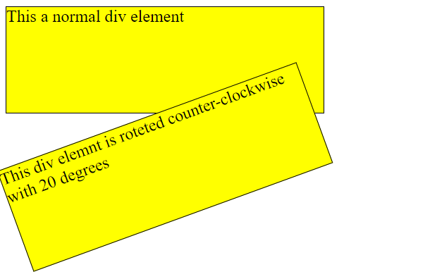

# -CSS-Styling-Exploring-Div-Element-Transformations-
    This HTML and CSS code showcases the art of styling div elements using CSS transformations. Two div elements, each with a distinct class, are presented. The first div (class="a") represents a normal div with standard dimensions, while the second div (class="b") demonstrates the creative use of the transform property. The second div is uniquely styled with a counter-clockwise rotation of 20 degrees, adding a visually appealing twist to the typical div element. The code provides a simple yet illustrative example of how CSS transformations can enhance the presentation of HTML elements on a webpage.
   

